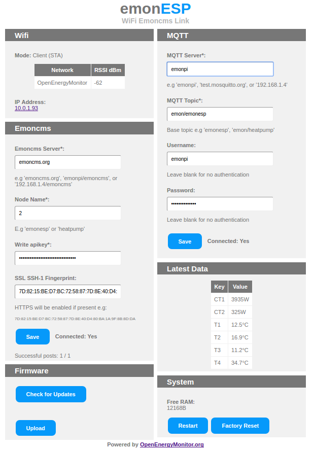

# Energy Monitor Build Workshop

The workshop will cover building a singe-phase AC energy monitor using the open-source Arduino and ESP8266 microcontroller platforms.

## 1.emonTx Energy Monitor

The emonTx is based on the Arduino platform using the 8-bit ATmega328p microcontroller to take samples of the current and voltage waveforms and calculate a power reading. The power reading is then printed to the UART serial pins.  

### a.) [Assemble emonTx](emontx) 	
### b.) [Load Firmware](emontx/firmware)

## 2. [WiFi Pixel Display](pixel/readme.md)

The WiFi Pixel display features the ESP8266 wifi-enabled microcontroller and and 16 neo-pixel serial addressable RGB LEDs. We can use it to:  

### a.) Display power value using LEDS

- Take serial UART string from emonTx e.g. `ct1:724,vrms:231`
- Display visual LED indication of power value from `ct1` sensor

### b.) Configure WiFi & post to Emoncms.org

- Serve up a config web-page via internal web-server
- Post to [Emoncms.org](https://emoncms.org) via WiFi

## 3. [Emoncms.org](https://emoncms.org)

Post data readings online to [Emoncms.org](https://emoncms.org) cloud  application via WiFi connection. Emoncms can be used to log, visualise and analyse power data.

- [Example Live MyElectric dashboard](https://emoncms.org/app?readkey=c0c644bb3f86eab9e308668b5bef6b51#myelectric)
- [Example live MySolarPV Dashboard](https://emoncms.org/app?readkey=871ad5efb8f20f698f12d751aea9b8a6#mysolarpv)
- [Live custom dashboard example](http://vpn.linemanhut.co.uk:8080/emoncms/dashboard/view?id=1)

***

*Glyn Hudson | [OpenEnergyMonitor.org](https://openenergymonitor.org) | November 2016*
