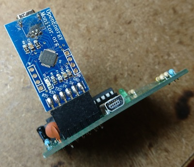
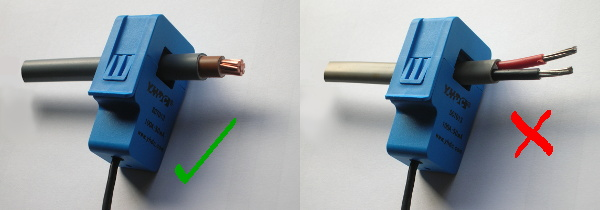

# emonTx Firmware

The emonTx firmware uses the C++ Arduino framework.

## Compile & Upload Using PlatfomIO

We will use [PlatformIO](https://platformio.org) to compile and upload the firmware. Arduino IDE can also be but PlatformIO is easier to setup since all required libraries and tool chains are automatically downloaded.

#### Install platformIO

PlatformIO (pio) works great from the command line, follow these instructions to install and run platformIO from the commandline. See the excellent [PlatformIO Quick Start Guide](http://docs.platformio.org/en/latest/quickstart.html) for more info. Platform IO has also got a GUI interface based on the Atom text editor. See PlatformIO website for install guide

The easiest way to install if running Mac / Linux is to use the install script, this installs pio via python pip and installs pip if not present. See [PlatformIO installation docs](http://docs.platformio.org/en/latest/installation.html#installer-script):

`$ sudo python -c "$(curl -fsSL https://raw.githubusercontent.com/platformio/platformio/master/scripts/get-platformio.py)"`

See PlatformIO website for [Windwows install guide](http://docs.platformio.org/en/latest/installation.html#local-download-mac-linux-windows)

### Compile

Enter project dir and run platformIO (pio):

```
$ cd build-workshop/emontx-pixel-emonesp/emontx/firmware
$ pio run
```

*`platformio.ini` file in the project dir contains info regarding what platforms and libraries to install*

### Upload

Connect emonTx via USB to UART cable:



*Note: The mini-USB socket cannot be used for programming, only to provide power to the unit*

Then run:

`$ pio run -t upload`

*Note: this may require `sudo`*

**After firmware upload we should see the green LED light up then flash every 2s.**

### View serial output

PlatformIO can also be used to view the serial output from the emonTx:

`$ pio device monitor -b115200`

You should see serial output of:

`ct1:xxx,vrms:xxx`

*These comma-separated sing-pairs are used to communicate the Power from CT1 and VRMS to the WiFi Pixel running EminESP firmware. See next step*

### Sensor Installation

AC-AC voltage sensor adapter and clip-on CT must plugged into the emonTx.

##### Clip on CT current sensor

The clip on CT current sensor must be clipped round either the 'live' or 'neutral' cable, NOT both!



*A current transformer is similar to the more common voltage transformer that we are all familiar with. It has an iron or ferrite core and two windings. But unlike the voltage transformer, it comes with only one winding, on the secondary side. You supply the primary winding in the form of the cable that passes through the transformer core. And, as the name suggests, it works on currents, not voltages. Therefore it will generate an output current flowing in the secondary winding that is proportional to the current in the cable that is the primary winding. A burden resistor in parallel to the CT secondary is used to convert the current signal to a voltage wavefrom we can then sample using the microcontroller analoge input*

See theory folder for more information about how CT sensor work.

##### AC-AC Adapter

The AC-AC adapter provides the emonTx with a AC voltage signal sample. This allows the emonTx to monitor VRMS, calculate Real Power and determine direction of current flow. See docs in 'theory' folder for info on how this works.

*Note: The AC-AC voltage sensor adapter does NOT provide power to the emonTx. A separate USB 5V power supply is required. The [emonTx V3](https://https://shop.openenergymonitor.com/emontx-v3-electricity-monitoring-transmitter-unit-433mhz/) can be powered directly from the AC-AC adapter since the emonTx V3 includes a [half-wave rectifier power supply circuit](http://blog.openenergymonitor.org/2012/05/emontx-single-ac-power-supply/)*


##  Next > Connecting emonTx to WiFi Pixel

See 'pixel' folder.
