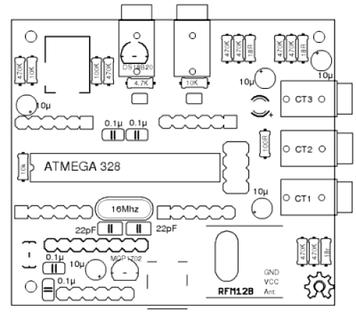

## emonTx V1 Build Guide

### Single CT no RF

Adapted from [full emonTx V1 build guide](https://openenergymonitor.org/emon/emontx/make/assemble/buildguide22)

#### Component List

*   The emonTx PCB
*   4x 470k Resistors (yellow, violet, yellow, gold)
*   4x 100nF (0.1uF) Ceramic Capacitors
*   3x 10uF Electrolytic Capacitors
*   2x 22pF Ceramic Capacitors
*   1x 18 ohm 1% Resistors (brown, grey, black, gold, brown on blue)
*   2x 10k 1% Resistors (brown, black, black, red, brown on blue)
*   1x 100k 1% Resistor (brown, black, black, orange, brown on blue)
*   1x 100 ohm Resistor (brown, black, brown, gold)
*   1x Atmel ATMega328 - the main microcontroller
*   1x 28-Pin DIL Socket
*   1x 16Mhz Crystal - for the ATMega328.
*   1x Mini B USB Socket
*   1x MCP1702 3.3v Voltage Regulator
*   1x Green LED
*   1x 2.1mm AC-AC Sensor Barrel Socket
*   1x 3.5mm Jack Sockets
*   1x 6pin Header (FTDI port)
*   1x Clip-on CT Sensor

***

#### Overview

**Single CT Build:**

**Port Map:**

***

#### Build Guide

