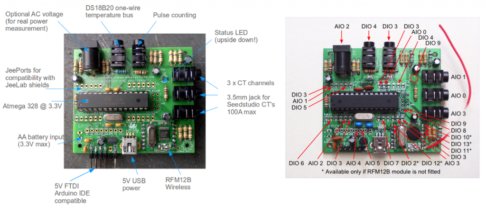

## emonTx V1 Build Guide

The emonTx is an energy monitoring unit based on the Arduino open-hardware microcontroller platform. The emonTx requires soldering assembly. 

- [emonTx Open-hardware design (github)](https://github.com/openenergymonitor/Hardware/tree/master/emonTxV2)

### Single CT no RF Build

This build guide is adapted from [full emonTx V1 build guide](https://openenergymonitor.org/emon/emontx/make/assemble/buildguide22)

#### Component List

*   The emonTx PCB
*   4x 470k Resistors (yellow, violet, yellow, gold)
*   4x 100nF (0.1uF) Ceramic Capacitors
*   3x 10uF Electrolytic Capacitors
*   2x 22pF Ceramic Capacitors
*   1x 18 ohm 1% Resistors (brown, grey, black, gold, brown on blue)
*   2x 10k 1% Resistors (brown, black, black, red, brown on blue)
*   1x 100k 1% Resistor (brown, black, black, orange, brown on blue)
*   1x 100 ohm Resistor (brown, black, brown, gold)
*   1x Atmel ATMega328 - the main microcontroller
*   1x 28-Pin DIL Socket
*   1x 16Mhz Crystal - for the ATMega328.
*   1x Mini B USB Socket
*   1x MCP1702 3.3v Voltage Regulator
*   1x Green LED
*   1x 2.1mm AC-AC Sensor Barrel Socket
*   1x 3.5mm Jack Sockets
*   1x 6pin Header (FTDI port)
*   1x Clip-on CT Sensor

***

#### Overview

**Single CT Build:**

**Ports:**

**Components:**

***

#### Build Guide

The PCB is built in an orderly sequence starting with the resistors and small components that are low on the board, then working up to the bulkier parts like connectors. After soldering each component, you need to cut off the excess component leg from the bottom using some cutters.

It is very easy to cause shorts which will make the board or specific parts of it not work, take your time during the build, be precise, use minimal solder and carefully check each joint after soldering it. If you suspect any short, check it with a multimeter and fix any shorts there and then, before continuing.

If you're new to soldering or looking to improve your technique we highly recommend these videos:

- [EEVBlog Soldering Tutorial - Part 1: Tools](http://www.eevblog.com/2011/06/19/eevblog-180-soldering-tutorial-part-1-tools)
- [EEVBlog Soldering Tutorial - Part 2: Soldering](http://www.eevblog.com/2011/07/02/eevblog-183-soldering-tutorial-part-2)

It's recommended you read through the whole of this guide and familiarise yourself with the steps before you start the actual build.

Start with the resistors. Form a 90 degree bend in each leg of the resistor right next to the body. It's recommended that you align them all in the same direction.

*Note: Unless specified component orientation does not matter*

##### Step 1 - 1 x 18R Resistor

`Brown, Grey, Black, Gold, Brown.`

##### Step 2 - 2 x 10K Resistors

`Brown, Black, Black, Red, Brown`

##### Step 3 - 1 x 100K Resistor

`Brown, Black, Black, Orange, Brown.`

##### Step 4 - 4 x 470K Resistors

`Yellow, Violet, Yellow, Gold.`

#### Step 5 - 100 ohm Resistor

`Brown, Black, Brown, Gold.`

#### Step 6 - 2 x 22pF Ceramic Capacitors

#### Step 7 - 4 x 100nF Ceramic Capacitors

#### Step 7 - Everything else!

*Note: Unless specified component orientation does not matter*

- 3 x 10uF electrolytic capacitors. **Orientation is important:** The PCB is marked with a (+) symbol to indicate the positive lead. The capacitors are marked with a white stripe and a short leg to indicate the negative lead and a longer leg to indicate the positive lead.
- Green LED:  **Orientation is important: long leg is positive (+)**
- 16 Mhz Crystal
- Mini-USB connector
- 3.5mm Jack plug socket into CT1
- MCP1702 voltage regulator (3.3V). **Orientation is important: see PCB outline**
- AC-AC 2.1mm Barrel jack
- DIL socket & ATmega328p microcontroller
- 6 x UART pin header

The RF module and CT 2-3 channel 2-3 components are not populated since they are not needed.

## [Next > emonTx Upload Firmware](firmware/)

*** 

## [< Return to main build workshop Index](https://github.com/openenergymonitor/build-workshop/tree/master/emontx-pixel-emonesp)

***

*Glyn Hudson | [OpenEnergyMonitor.org](https://openenergymonitor.org) | November 2016*