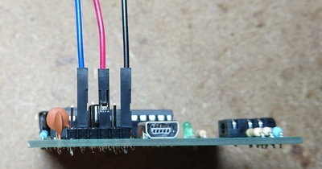
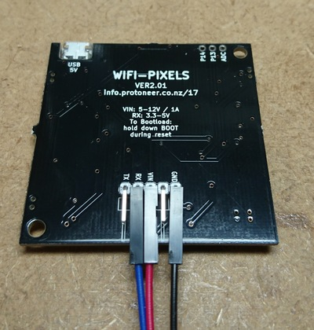
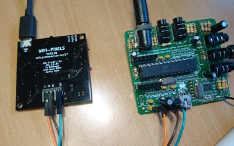
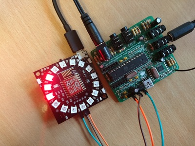
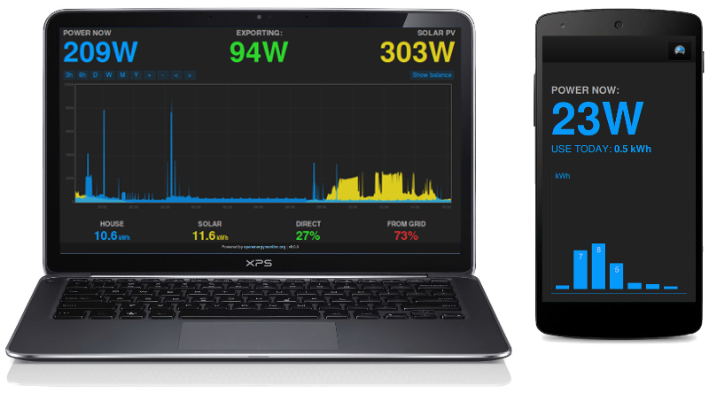
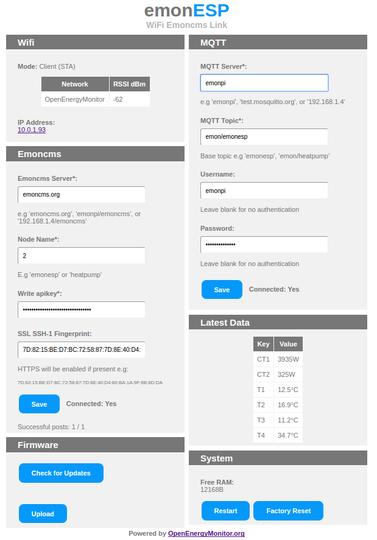
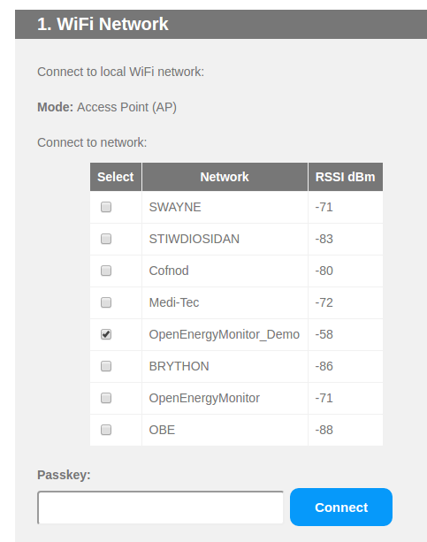
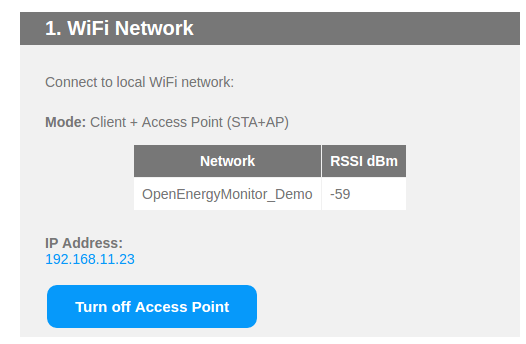
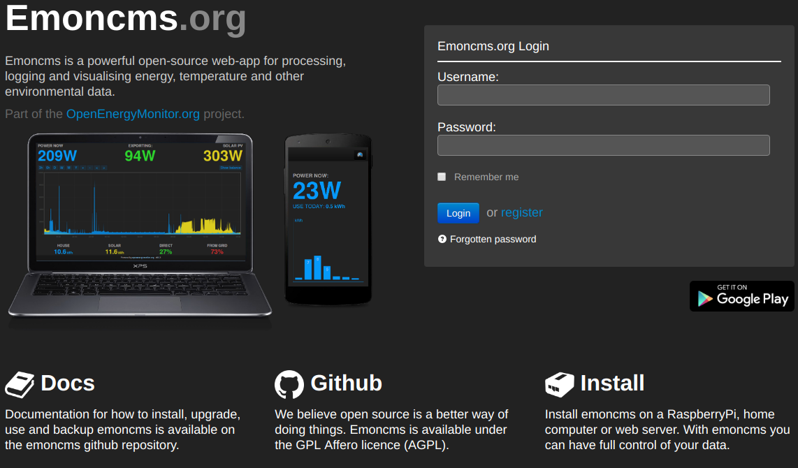

# EmonESP Pixel

The EmonESP Pixel is an ESP8266 WiFi enabled microcontroller with the addition of 16 neo-pixel GRB LED's.

## Features

1. Reads serial input string from emonTx e.g. `ct1:xx,vrms:xx`
2. Displays visual power value from `ct1` sensor via LED display
3. Post online to [Emoncms.org](https://emoncms.org) cloud via WiFi connection

## Firmware

**No action needed, WiFi Pixel firmware is preloaded**

- Pre-loaded due to time constraints but firmware can be loaded in the same way as emonTx firmware using PlatformIO. See `firmware/EmonESP` folder for instructions
- Running adapted [EmonESP](github.com/openenergymonitor/EmonESP) firmware
- Firmware upload / serial output must be done using USB to UART cable connected to UART pins on the read. Micro-USB is for power only

## Hardware Connections

Connect serial input from emonTx:

## LED Visual power reading

The WiFi pixel reads the serial string from the emonTx eg. `ct1:xxx,vrms:xxx` and displays a number of red pixels corresponding to ct1 power reading values:

For this demo each pixel displays a value of 68W giving a maximum reading (16 pixels) of 4080W or 4KW.

***

## Post data online to Emoncms cloud

Running EmonESP firmware the WiFi pixel can post the power reading data received from the emonTx to [Emoncms.org](https://emoncms.org) cloud platform for logging, graphing and analysis.

*Emoncms is a powerful open-source web-app for processing, logging and visualising energy, temperature and other environmental data.*

### 1. Connect WiFi Pixel to local WiFi Network

Power up the WiFi pixel either by connecting micro USB power or by connection power pin (Vin and GND) to emonTx using jumper cables as illustrated above.

The Pixel should illuminate all LED's in a colour pattern to indicate a normal boot mode. After a few seconds a few white LED's should light, this indicates that the WiFi Pixel is in WiFi Access Point (AP) mode.

*If the WiFi pixel has previously been connected to a WiFi network it will attempt to re-connect to this network, the force the unit into WiFi AP mode so we can connect direclty to it to change the WiFi config press and hold the `Boot` button during startup for about 10s until the white LED's indicate AP mode*

You should now be able to connect to the Wifi Pixel's AP using a laptop or mobile. The network name will be `emonESP_xxxx` where xxx is a number printed on the rear of the unit. When connected the phone or laptop should get automatically forward to the login portal. If this does not happen browser to [http://192.186.4.1](http://192.186.4.1). Once connected to the login portal (it may take a few moments to load) you should see the WiFi Pixels config page:

On the top right hand side you should be able to see data (ct1 & Vvrms) being received via serial from the emonTx (if it's connected). On the right hand side a list of available local Wifi networks should be displayed:

Check the box to connect to `OpenEnergyMonitor_Demo`, leave password blank, this network is open access. Click `Connect`

After a few moments (10s or so) you should see a connection confirmation notice and the local IP address of your WiFi Pixel should be displayed. **Make a note of this IP address, you will need to connect**.

Now connect your laptop to `OpenEnergyMontor-Demo` and browse to your WiFi Pixels IP address. You should see the same config page.

### 2. Create account on Emoncms.org

One logged in navigate to Setup > My Account then Copy Write API key.

### 3. Configure Wifi Pixel to post to your Emoncms account

Browse to your WiFi Pixels local IP address. You should see the same config page.

Now paste in your Emoncms.org RW API key you copied earlier into the emoncms section of the config and enter a **numerical node ID .e.g:  '6'**. Click `Save`

Data received via serial from the emonTx should now be being posted to emoncms.org via the Wifi Pixel. Log back into your emoncms.org account and navigate to the `Setup > Inputs` section. You should see ct1 and vrms data being updated.

These inputs can be logged to Emoncms feeds. See [Emoncms user guide](http://guide.openenergymonitor.org/setup/local/) for how to log inputs to feeds, view graphs, create dashboards & configure Android / iOS app.
