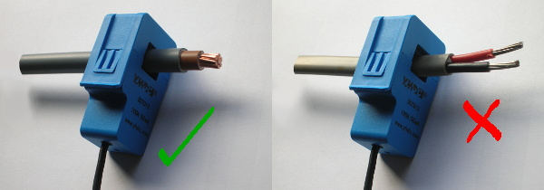
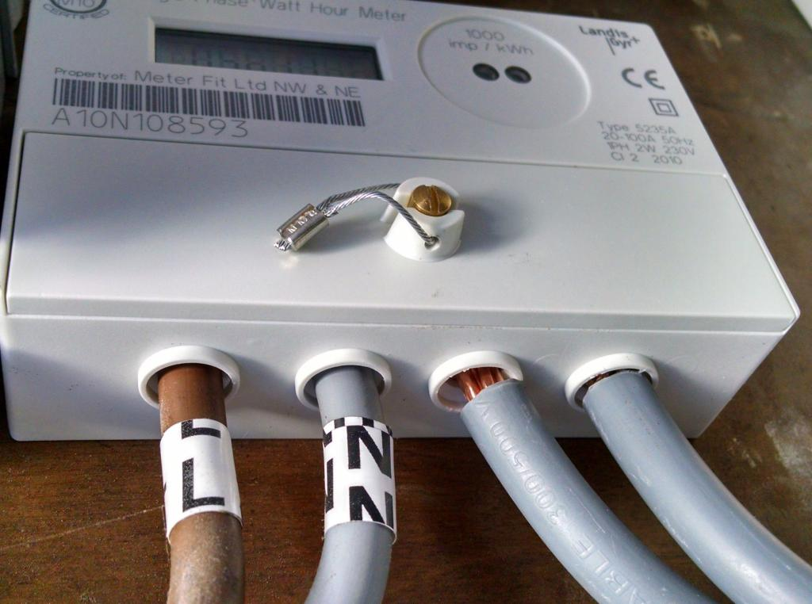

## Current Transformer Installation

One of the most common questions on the forums is “Why does my emonTx [Arduino] not measure anything?” – or a variation of that. Most often, it is because the current transformer has been installed incorrectly.

**THE CURRENT TRANSFORMER MUST BE ON A SINGLE CURRENT-CARRYING WIRE…**

…as in the left-hand picture.

If you put it on a twin-core, or any multi-core cable, as in the right-hand picture, then it will measure the sum of the currents in each of the conductors. In the case of a twin-core or twin core & earth cable, the same current will be flowing in opposite directions and the sum will be zero. This is almost certainly not what you want.

## Please read the whole of this page, and especially the warnings at the end, before touching the mains cables.

_Your safety is your responsibility. Clip-on current sensors are non-invasive and should not have direct (metallic) contact with the AC mains. However, installing the sensors will require working in close proximity to cables carrying high voltage. As a precaution, we recommend ensuring the cables are fully isolated, i.e. power is switched off prior to installing your sensors, and proceeding slowly and with care. If you have any doubts, seek professional assistance._

### Does the direction the CT is clipped on the wire, matter?

If you are interested in reading only apparent power, and you don't have an AC-AC adapter, it does not matter. The power reading will always be positive.

If you want to read real power, and you want to know in which direction power is flowing – e.g. when you generate your own electricity, and want to know whether you are importing or exporting – then the C.T. must face the correct direction. Our convention is: imported and generated powers are positive. If the C.T. faces the wrong way, it means that the power you expect to be positive will be shown as negative.  
_[Note: Robin Emley has adopted the opposite convention for his Mk 2 energy diverter – he regards _exported_ power as positive.]_

For the UK ac-ac adapter and the YHDC C.T. purchased from [the shop](https://shop.openenergymonitor.com/components/) and when the C.T. is on the line conductor, the printing on the face of the C.T. should face in the direction of positive power, i.e. in the picture above, positive power flow is from left to right. If the C.T. is on the neutral conductor (this is only valid on a single-phase installation) it should face in the opposite direction. For any other combination of ac-ac adapter and C.T. it is possible, if the phasing of each is known, to determine the correct orientation, but the easiest and quickest method is probably by trial and error. Reversing the C.T. will change the sign of that input. Reversing the ac-ac adapter (where the plug design allows this) will change the sign of <u>all</u> inputs.

## The details

### What is a Current Transformer?

A current transformer is similar to the more common voltage transformer that we are all familiar with. It has an iron or ferrite core and two windings. But unlike the voltage transformer, it comes with only one winding, on the secondary side. You supply the primary winding in the form of the cable that passes through the transformer core. And, as the name suggests, it works on _currents_, not voltages. Therefore it will generate an output current flowing in the secondary winding that is proportional to the current in the cable that is the primary winding. The C.T. will generate whatever voltage is necessary to drive that current – within limits of course. See “Warnings” below.

### Types of Current Transformer

There are two types, they operate in exactly the same way, the difference is in their construction.

1\. The Ring-core Current Transformer.  
The core is solid, and the cable you wish to put it on, needs to be disconnected in order to install the CT. Therefore, it's used only where it's practical, safe and legal to disconnect the circuit. Its advantage is higher accuracy.

2\. The Split-core Current Transformer.

The core is in two parts held together by clips or screws. The two parts are simply placed around the cable and assembled. There is no need to disconnect anything. Provided the current transformer has a burden connected, it can be installed on a live, insulated, current-carrying cable.

### How a CT works

A wire carrying an electric current sets up a magnetic field around it. The wire forms the primary winding of the transformer. The iron (or ferrite) transformer core concentrates the field and couples it to the secondary winding. and, provided the magnetic field continually changes, causes a current to flow in that winding too. That current flows in the burden resistor, which generates a voltage the emonTx can use.  
A current transformer will **not** measure direct current.

You _can_ pass more than one wire through the opening of a current transformer if you want the sum (more specifically, the **vector sum**) of the currents. There are two common instances where this is useful:

1.  You have a small current and it is difficult to get an accurate reading. In this case, the wire diameter is small. It's possible to wind it into a coil and the C.T. can be fastened to the coil, or the wire can be passed though the CT opening several times in the same direction, effectively multiplying the current by the number of turns passing through the core. You can correct the reading by changing the calibration of that input.
2.  You have many small loads on different circuits, and you want to measure the total current used by those circuits. All the circuits must be on the same phase, and all the wires must pass through the CT in the same direction. If one wire passes through the CT in the opposite direction, the current in that wire will be <u>subtracted</u> from the total.

### Warnings

If an unburdened CT (i.e. one without a burden resistor) is attached to a current-carrying conductor, the CT will generate an unsafe voltage at its leads which could break down the insulation and destroy the C.T.

The YHDC transformer sold in the Shop has internal Zener diodes to limit the maximum unburdened voltage output to a safe level. C.T's with internal burden resistors (‘the voltage output’ type) are also protected against developing dangerous voltages.

_**Always**_ connect the C.T. leads _before_ clipping it round a current-carrying conductor, and _**always**_ un-clip the C.T. from the current-carrying conductor _before_ disconnecting its leads.

_**Never**_ open-circuit a C.T. whilst it is on a current-carrying conductor. It is _**always**_ safe to short-circuit a C.T.

<u>_**NEVER**_</u> attempt to fit a C.T. to a bare conductor unless you are absolutely certain it is designed for that. Apart from the obvious danger of electric shock, there are two factors to be considered: the strength of the C.T.'s insulation, and its ability to withstand the higher temperatures at which bare conductors normally operate.

A split-core CT, especially one that has a ferrite core (such as the ones made by YHDC) should _**never**_ be "clamped" to the cable using any sort of packing material, because the brittle nature of the ferrite core means that it might easily be broken, thus destroying the CT. You should only clamp the CT to the cable or busbar if the housing is specifically designed to do so. Similarly, a ring-core CT should **_never_** be forced onto a cable that is too large to pass freely through the centre. The position and orientation of the cable within the CT aperture makes no practical difference to the output.

_**If any part of your wiring looks like this:**_

then you must get professional advice. Even though the meter shown above was (presumably) installed and sealed by the electricity distribution authority, it is dangerous and _illegal_ because a bare conductor is exposed.

(Exposed copper is visible on both the line and neutral conductors. Just because the worst is the neutral conductor is no excuse. If the neutral is damaged and broken anywhere on the supply side of this meter, that neutral then becomes live at the full mains voltage if anything is switched on downstream.)

