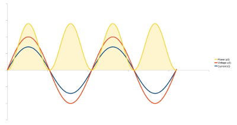
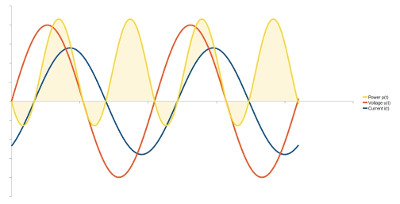
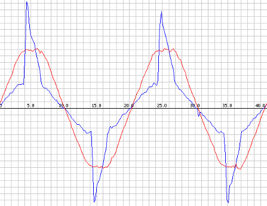
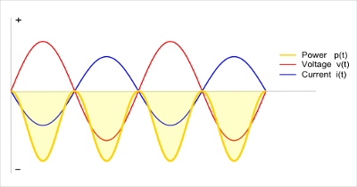

## An introduction to AC Power

### Understanding AC power.

A whole house energy monitor measures the energy used by appliances connected to the house mains. To understand how it does this, it is useful to know something about how appliances interact with the electrical system.

Not all appliances interact with the electricity system in the same way. This article will first discuss resistive loads and how the power they use is calculated. It then goes on to discuss reactive loads, and a bit about non-linear loads. Finally, it will show how we measure the direction of power flow, which is important if energy is  generated as well as consumed.

**Resistive loads**

Incandescent light bulbs, kettles, irons, electric water heaters, electric cookers are all quite straightforward. They use all the energy given to them. They are resistive loads which means their current draw is equal to the voltage divided by their resistance (Ohms Law). A purely resistive load gives a voltage and current waveform output similar to the following:

**_Diagram 1_** _– Voltage and current phase relationships in a resistive load_

The yellow line is power at a given time (at any given instant it's called **instantaneous power**) which is equal to the product of the voltage and current at a given time. Notice the power is always positive. In this case, the positive direction is energy flowing to the load.

**Partially reactive loads**

However things like fridges, washing machines, pillar drills and arc welders are not so straightforward as these appliances take in a certain amount of energy, then release some energy back into the mains supply. These have inductive (e.g. motors) or capacitive (e.g. arc welders) components in addition to the resistive component. A partially inductive load gives a voltage and current waveform output similar to the following:

**_Diagram 2_** _– Voltage and current phase relationships in a partially reactive load_

Notice the yellow line now goes negative for a period of time, the positive bit is energy flowing to the load and the negative bit is energy flowing back from the load.

The other thing to consider is that the voltage and current waveforms have been shifted apart. Imagine charging a fairly large capacitor with a resistor in series (so that it can't charge instantly): To start with, the capacitor is discharged. The supply voltage rises, and is higher than the voltage on the capacitor, so current flows into the capacitor (the positive direction on the graph), which causes the capacitor voltage to rise. The supply voltage falls. Now, the voltage across the charged capacitor is higher than the supply voltage. Current starts to flow back in the direction of the supply (the negative direction on the graph). This causes the current waveform to appear as if it is shifted, as depicted in the graph. (This is referred to as phase shift).

**Real Power, Reactive power and Apparent Power.**

Looking at the voltage, current and power graphs above at mains frequency the power draw fluctuates 50/60 times a second. We cant keep up with change at this speed, so we have a more useful value for power: the average of the instantaneous power, which we call **real** or **active** power.

Real power is often defined as the power used by a device to produce useful work. Referring to the graph above, the positive bits are power going to the load from the supply, and the negative bits are power going back to the supply, from the load. The power that was actually used by the load, i.e. the power going to, minus the power going back, is the real power.

**Reactive** or **imaginary** power, is a measure of the power going back and forth between the load and the supply that does no useful work.

Another useful measure of power is **Apparent Power**, which is the product of the Root-Mean-Square (RMS) Voltage and the RMS Current. For purely resistive loads, real power is equal to apparent power. But for all other loads, real power is less than apparent power. Apparent power is a measure of the real and reactive power, but it is not a sum of the two, as the sum of the two does not take into account phase differences.

Relationship between real, reactive and apparent power for IDEAL sinusoidal loads:

_Real Power = Apparent Power x cosΦ_

_Reactive Power = Apparent Power x sinΦ_

_cosΦ_ is also known as power factor.

**However a note about non-linear loads:**

This power factor relationship is valid only for <u>_linear_</u> sinusoidal loads. Most power supplies for DC devices like Laptop computers, present a non-linear load to the mains. Their current draw often looks like this:

We can still calculate power factor from the following equation:

_Power Factor = Real Power / Apparent Power_

but the relationship

_(Apparent Power)2 = (Real Power)2 + (Reactive Power)2_

which is true for pure sine waves, is no longer correct. Neither is _power factor = cosΦ_, since the effects of higher order harmonics in both voltage and current waveforms must be considered.

**The power factor value measures how much the mains efficiency is affected by BOTH phase lag φ AND harmonic content of the input current.**

[Ref: understanding power factor by L Wuidart](files/Wuidart.pdf)

### Determining the direction of power flow.

Until now, this article has assumed that the load is consuming power. If however, we are generating power, then the direction the current flows is reversed. But because the current is alternating, the direction is reversing anyway, 50 (or 60) times each second. We need a reference to compare the current direction against. Fortunately, we have that in the form of the voltage. In diagram 1, the voltage and current waves both rose and fell together. When the voltage was positive (above the X axis) the current was positive, and when the voltage was negative (below the x axis) the current was negative. Power is equal to the product of the voltage and current, and so the power was always positive - all of the power curve is above the X axis.

If the house is generating power, the direction of the current is reversed compared to our previous example. Now when the voltage is positive, (above the X axis) the current is negative (below the X axis), and when the voltage is negative, the current is positive. The power always negative - all of the power curve is below the X axis.

**_Diagram 4_** _– Voltage and current phase relationships when generating energy._

The sign of the power therefore indicates whether power is being consumed or generated.

**To sum up**

There are many parameters we can measure regarding energy use in AC systems. Each one has its merits. For the household energy metering, real power is likely to be the most useful value, as it is tells you how much power all your appliances are actually consuming, and it is what the utility bills you for.

Next: [AC Power Theory - Arduino maths](arduino-maths) - How real and apparent power, rms voltage and current, and power factor are calculated.

**Further reading**

[https://en.wikipedia.org/wiki/AC_power](https://en.wikipedia.org/wiki/AC_power)

Power in resistive and reactive loads: [https://www.allaboutcircuits.com/vol_2/chpt_11/1.html](https://www.allaboutcircuits.com/vol_2/chpt_11/1.html)

Single phase power systems: [https://www.allaboutcircuits.com/vol_2/chpt_10/1.html](https://www.allaboutcircuits.com/vol_2/chpt_10/1.html)

[Powerbox](https://instruct1.cit.cornell.edu/courses/ee476/FinalProjects/s2008/cj72_xg37/cj72_xg37/index.html)

***

*Glyn Hudson | [OpenEnergyMonitor.org](https://openenergymonitor.org) | November 2016*
